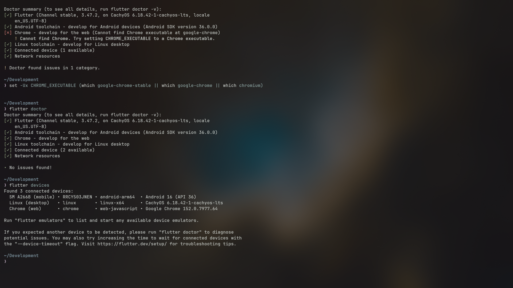
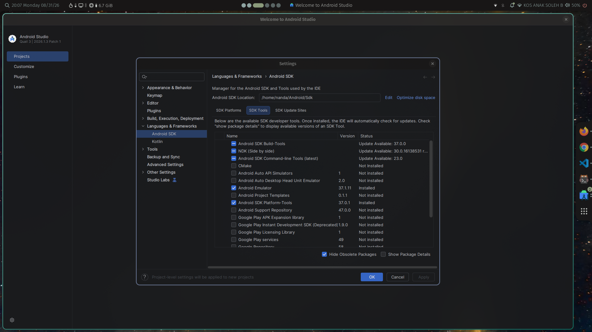
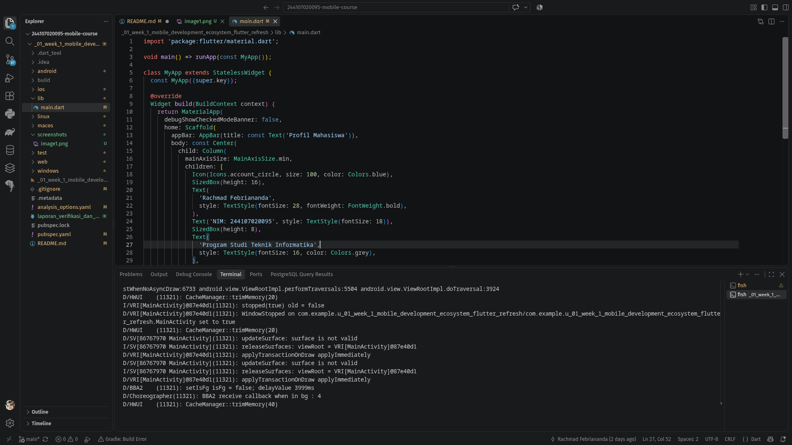
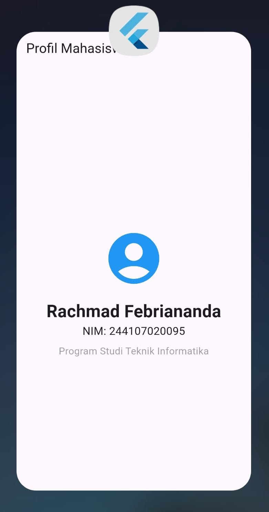

# _01_week_1_mobile_development_ecosystem_flutter_refresh

## Verifikasi, Tugas, dan Refleksi

## 1. Checklist verifikasi

### Flutter doctor

Hasil pengecekan `flutter doctor` menunjukkan kondisi yang aman untuk target Android.

- Flutter terinstal dengan status normal.
- Android toolchain aktif dan siap untuk build aplikasi Android.
- Tidak ditemukan masalah yang menghambat pengembangan target Android.
- Output yang valid: `No issues found!`

### Flutter devices

Hasil `flutter devices` mendeteksi perangkat yang terhubung secara nyata, yaitu:

- `SM A266B (mobile) • android-arm64 • Android 16 (API 36)`

Artinya aplikasi dapat dijalankan langsung pada perangkat Android yang terhubung.

### Aplikasi berjalan dan UI default diganti

Aplikasi sudah berhasil dijalankan pada perangkat Android. UI default Flutter telah diganti dengan tampilan profil sederhana mahasiswa.

Detail informasi yang ditampilkan:

- Nama: Rachmad Febriananda
- NIM: 244107020095
- Informasi tambahan: Program Studi Teknik Informatika

Berikut screenshot aplikasi:

### Perbedaan hot reload dan hot restart

- Hot reload: memperbarui UI pada kode yang sudah berubah tanpa menghentikan aplikasi. Proses ini lebih cepat dan cocok saat mengembangkan tampilan atau memperbaiki kecil.
- Hot restart: menghentikan aplikasi dan menjalankan ulang seluruh state aplikasi dari awal. Proses ini lebih lambat, tetapi lebih aman ketika perubahan memengaruhi inisialisasi, state, atau konfigurasi yang lebih besar.

Kesimpulannya, hot reload lebih cocok untuk iterasi cepat; hot restart lebih cocok saat perubahan yang dibuat terlalu besar atau memerlukan reset eksekusi keseluruhan.

### Repository remote

Repository remote sudah tersedia pada URL berikut:

- https://github.com/rachmadnanda/244107020095-mobile-course.git

Repository tersebut memuat source code, README, commit history, dan juga screenshot yang dibuat untuk portofolio. Selain itu, riwayat commit yang ada menunjukkan perkembangan proyek yang terdokumentasi dengan jelas.

---

## 2. Mini assignment: Aplikasi Profil Mahasiswa

### Deskripsi

Aplikasi dibuat dengan Flutter dan menampilkan profil mahasiswa menggunakan widget dasar seperti `Text`, `Column`, `Center`, `Icon`, dan `SizedBox`.

### Data yang ditampilkan

- Nama: Rachmad Febriananda
- NIM: 244107020095
- Informasi tambahan: Program Studi Teknik Informatika

### Struktur utama aplikasi

File utama program berada di:

- `lib/main.dart`

Isi utama aplikasi berbentuk `MaterialApp` dengan `Scaffold`, `AppBar`, dan layout `Center` + `Column` untuk menampilkan informasi profil.

### Kendala setup yang dihadapi

Salah satu kendala yang saya hadapi adalah saat melakukan pengambilan screenshot aplikasi dari perangkat Android. Awalnya tools Android tidak langsung ditemukan pada path yang benar, sehingga ADB tidak bisa dipanggil dengan lancar. Setelah mencari lokasi instalasi SDK Android, saya menemukan binary di `/home/nanda/Android/Sdk/platform-tools/adb` dan berhasil melakukan capture screenshot dengan benar.

Kendala ini memberi pembelajaran bahwa konfigurasi Android SDK dan path environment sangat penting untuk kelancaran pengembangan Flutter, terutama saat target perangkat fisik digunakan.

---

## 3. Refleksi

### 3.1 Kapan native lebih tepat dipilih daripada cross-platform?

Native lebih tepat dipilih ketika aplikasi membutuhkan performa maksimal, akses mendalam ke fitur perangkat, optimasi untuk hardware tertentu, atau pengalaman yang sangat spesifik pada platform tertentu. Contohnya pada aplikasi game, aplikasi multimedia, aplikasi yang sangat bergantung pada sensor, kamera, atau fitur sistem yang kompleks.

Cross-platform seperti Flutter sangat cocok untuk pengembangan yang efisien dan cepat di beberapa platform, tetapi native tetap unggul ketika kebutuhan performa dan integrasi platform sangat tinggi.

### 3.2 Bagaimana perubahan state berhubungan dengan widget tree dan UI deklaratif?

Pada Flutter, state menentukan data yang sedang aktif, dan widget tree adalah struktur tampilan yang dibangun berdasarkan state tersebut. Ketika state berubah, Flutter membangun ulang widget tree secara deklaratif sesuai kondisi data terbaru.

Maknanya, kita tidak mengubah tampilan secara imperatif satu per satu; kita cukup memperbarui state, lalu Flutter akan merender ulang bagian yang relevan. Ini membuat pengembangan UI lebih konsisten dan lebih mudah dipahami.

### 3.3 Mengapa commit kecil dengan pesan jelas bermanfaat bagi pekerjaan tim dan portfolio?

Commit kecil dengan pesan jelas sangat berguna karena:

- memudahkan tracking perubahan riwayat proyek;
- memudahkan review kode oleh tim;
- membantu menemukan sumber bug atau fitur tertentu;
- menunjukkan proses pengerjaan yang rapi pada portfolio.

Untuk tim, commit yang jelas mempercepat kolaborasi dan pengelolaan merge. Untuk portfolio, commit yang terstruktur menunjukkan kemampuan developer dalam menulis log kerja dan menjaga kualitas proyek.

---

## 4. Kesimpulan

Proyek Flutter ini berhasil diverifikasi berjalan dengan baik pada perangkat Android yang terhubung. Aplikasi profil mahasiswa telah dibuat sesuai kebutuhan, UI default telah diganti, dan dokumentasi hasil kerja dapat disusun dalam format markdown terpisah. Proses ini juga memperkuat pemahaman mengenai setup Android, widget dasar Flutter, serta pentingnya dokumentasi dan commit yang rapi.

---

A new Flutter project.

## Getting Started

This project is a starting point for a Flutter application.

A few resources to get you started if this is your first Flutter project:

- [Learn Flutter](https://docs.flutter.dev/get-started/learn-flutter)
- [Write your first Flutter app](https://docs.flutter.dev/get-started/codelab)
- [Flutter learning resources](https://docs.flutter.dev/reference/learning-resources)

For help getting started with Flutter development, view the
[online documentation](https://docs.flutter.dev/), which offers tutorials,
samples, guidance on mobile development, and a full API reference.
