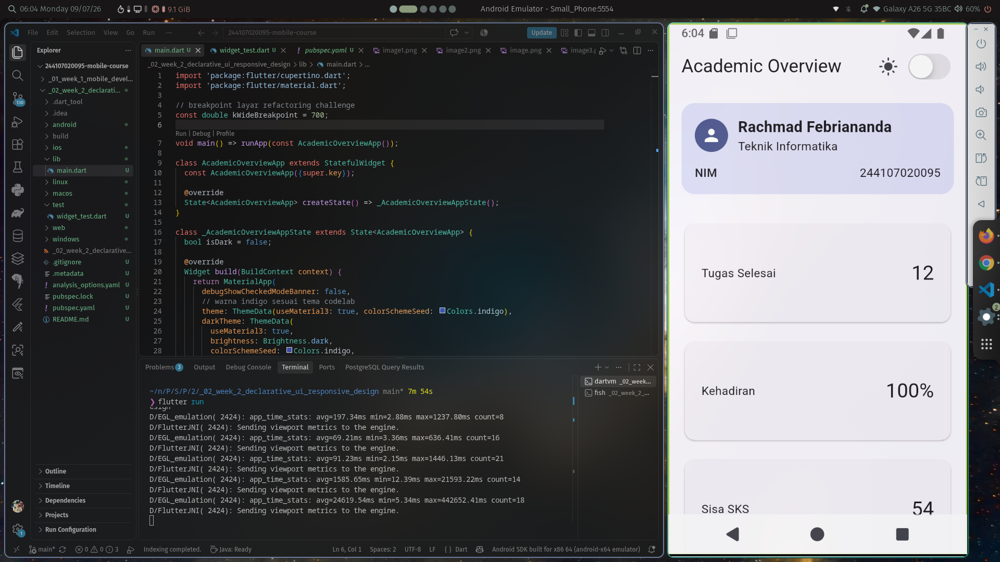
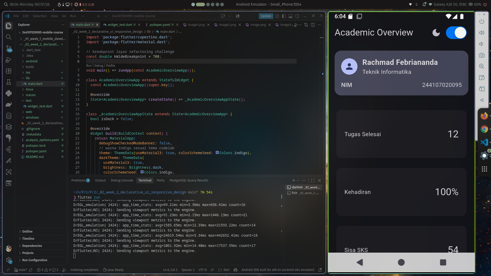
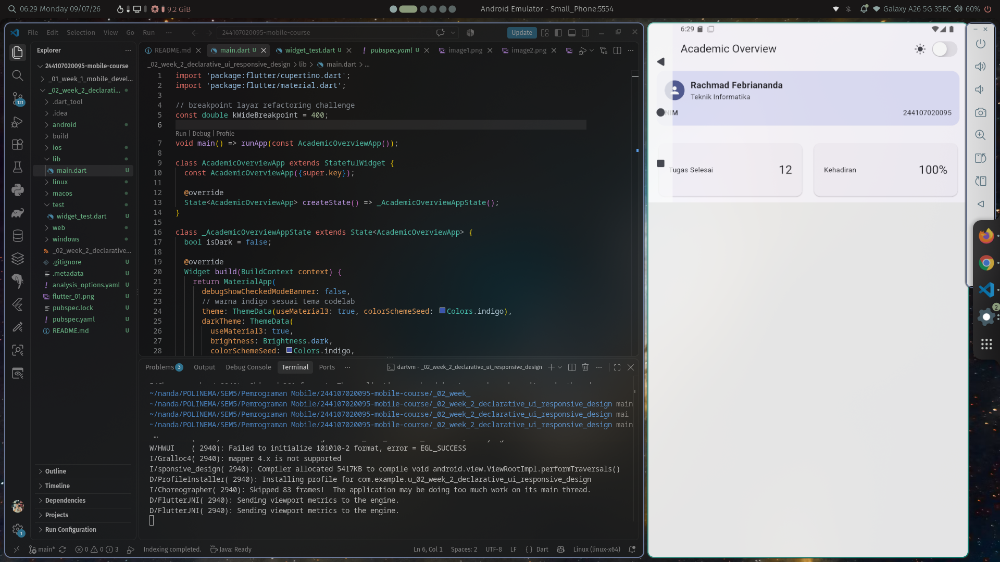
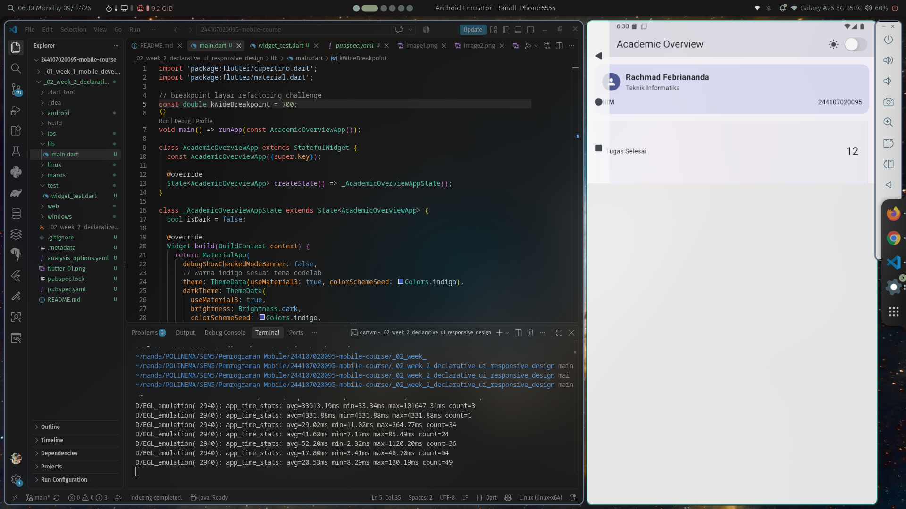

# 02 Week 2: Declarative UI & Responsive Design

## Rachmad Febriananda - 244107020095 - TI3H

## Tujuan Pembelajaran
- Memahami prinsip *declarative UI* dan hubungannya dengan widget, konfigurasi, serta *state*.
- Menggunakan widget dasar seperti `StatelessWidget`, `StatefulWidget`, `Container`, `Row`, `Column`, dan `Expanded`.
- Membedakan komponen Material 3 dan Cupertino untuk platform yang berbeda.
- Membangun layout responsif untuk ukuran layar mobile dan tablet menggunakan `LayoutBuilder`.
- Menerapkan *theme*, *dark mode*, styling dinamis, dan aksesibilitas dasar (`Semantics`).

## Fitur Utama (Academic Overview)
- **Header Profil**: Menampilkan ringkasan data mahasiswa (Nama, Prodi, NIM) secara rapi menggunakan kombinasi `Row`, `Column`, dan `Expanded`.
- **Dashboard Responsif**: Tata letak grid yang otomatis beradaptasi. Menampilkan 1 kolom pada layar sempit (< 700px) dan 2 kolom pada layar lebar (>= 700px).
- **Tema Terang & Gelap**: Dilengkapi dengan `CupertinoSwitch` pada AppBar untuk mengganti mode terang/gelap (*light/dark mode*) secara langsung.
- **Aksesibilitas**: Penggunaan label pembaca layar (screen reader) pada kartu informasi untuk meningkatkan aksesibilitas aplikasi.

## Stack Teknologi
- **Framework**: Flutter
- **Bahasa**: Dart
- **Komponen Utama**: Material 3 (Theme, Card, GridView) & Cupertino (CupertinoSwitch)

## Screenshot
Berikut adalah dokumentasi hasil tata letak responsif:

### 1. Layar Sempit (Satu Kolom)


### 2. Layar Sempit (Satu Kolom Dark)


### 3. Layar Lebar (Dua Kolom)


### 3. Layar Lebar (Satu Kolom)


## Cara Menjalankan
1. Pastikan Anda berada di direktori proyek minggu ke-2:
   ```bash
   cd _02_week_2_declarative_ui_responsive_design
   ```
2. Jalankan aplikasi pada emulator atau perangkat fisik:
   ```bash
   flutter run
   ```
3. Untuk menjalankan pengujian (*testing*):
   ```bash
   flutter test
   ```

## AI Design Exploration
**Prompt Challenge yang diajukan:**
> "Bandingkan dua tata letak dashboard akademik untuk Flutter: versi GridView dan versi LayoutBuilder + Column. Jelaskan trade-off responsif dan aksesibilitasnya."

**Hasil & Keputusan:**
- AI menyarankan kombinasi: `Column` utama untuk memisahkan Header Profil dan Dashboard. Di dalam dashboard, digunakan `LayoutBuilder` yang membungkus `GridView.count`.
- **Trade-off Responsif**: Penggunaan `GridView` mempermudah pengaturan `crossAxisCount` secara dinamis dibanding menggunakan `Column` dan `Row` yang disusun manual. Namun, `GridView` di dalam `Column` harus dibungkus dengan `Expanded` agar tidak memicu error *unbounded height* (layout overflow).
- **Aksesibilitas**: AI menyarankan penambahan atribut `semanticsLabel` pada widget `Text` di dalam kartu info. Keputusan ini diimplementasikan untuk memberikan konteks (misal: "Kategori informasi: Tugas Selesai") kepada pengguna *screen reader*.
- **Verifikasi**: Kode saran AI telah diverifikasi dan berjalan baik tanpa peringatan *overflow* pada resolusi di bawah 600px. Seluruh *widget* yang dipakai merupakan bagian dari *library* standar Flutter stabil saat ini.

## Refactoring Challenge
Sesuai instruksi, kode telah dirapikan (refactoring) dengan pencapaian:
1. **Ekstraksi Reusable Widget**: Memisahkan UI menjadi `ProfileCard` dan `InfoCard` untuk menghindari duplikasi kode dan mempermudah pemeliharaan.
2. **Theming Dinamis**: Warna yang di-*hardcode* telah diganti menggunakan `Theme.of(context).colorScheme` (misal: `colorScheme.secondaryContainer`) agar warna kartu berubah otomatis saat berpindah ke *Dark Mode*.
3. **Konstanta Breakpoint**: Titik pecah responsif telah dipindahkan ke konstanta global `const double kWideBreakpoint = 700;`.
4. **Clean Code**: Pemeriksaan `flutter analyze` berhasil lulus tanpa *error* maupun *warning*.

## Testing Dasar
Pengujian (*Widget Test*) telah ditambahkan pada folder `test/` untuk memverifikasi perilaku tata letak:
- `Dashboard satu kolom di layar sempit`
- `Dashboard dua kolom di layar lebar`

## Refleksi
**1. Apa perbedaan cara berpikir imperative dan declarative saat membangun UI?**
- Imperative berfokus pada "langkah-langkah" (bagaimana cara mengubahnya). Kita harus memilih elemen spesifik (misal lewat ID) lalu memodifikasi propertinya satu per satu.
- Declarative berfokus pada "hasil akhir" berdasarkan data (*state*) saat ini. UI adalah fungsi dari *state*. Saat data berubah, Flutter akan secara otomatis me-*rebuild* bagian UI yang relevan agar sesuai dengan data terbaru tanpa instruksi modifikasi manual.

**2. Kapan Expanded membantu dan kapan penggunaannya justru menghasilkan layout error?**
- `Expanded` sangat membantu untuk mengisi atau membagi sisa ruang kosong secara proporsional di dalam `Row` atau `Column`.
- Sebaliknya, `Expanded` akan menghasilkan error (seperti *RenderFlex children have non-zero flex but incoming height constraints are unbounded*) jika digunakan di dalam *widget* yang bisa di- *scroll* dan tidak memiliki batasan ukuran pasti, seperti `SingleChildScrollView` atau `ListView`.

**3. Bagaimana breakpoint dan theme memengaruhi pengalaman pengguna?**
- **Breakpoint** memastikan informasi disajikan dengan ukuran dan tata letak yang proporsional sesuai perangkat pengguna (HP maupun Tablet). Ini mencegah teks terlalu rapat di layar kecil atau terlalu merenggang (*whitespace* berlebih) di layar besar.
- **Theme** memberikan konsistensi desain. Khususnya *Dark Mode*, fitur ini sangat memengaruhi kenyamanan visual, mengurangi ketegangan mata, dan pada beberapa jenis layar (OLED) dapat menghemat baterai.

**4. Apa yang Anda verifikasi dari rekomendasi AI setelah tugas inti selesai?**
Saya memverifikasi tiga hal utama dari *output* AI: 
- Kestabilan kode memastikan *widget* bukan komponen *deprecated*.
- Responsivitas absolut memastikan tidak muncul garis kuning-hitam (*overflow*) saat layar dikecilkan secara ekstrem.
- Validitas aksesibilitas memastikan penggunaan `Semantics` atau atribut terkait ditempatkan pada level *widget* yang benar agar berfungsi nyata jika dibaca *screen reader*.