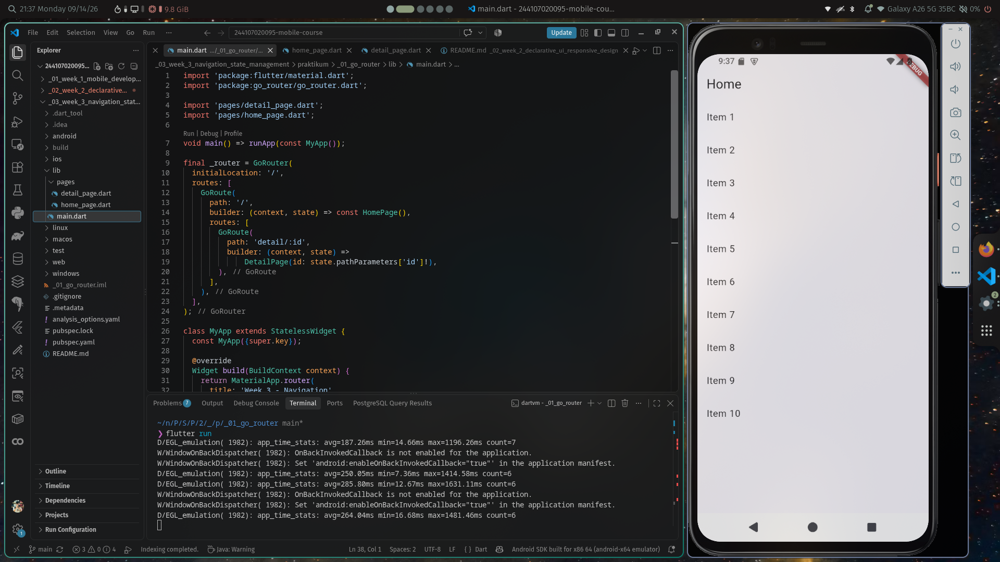
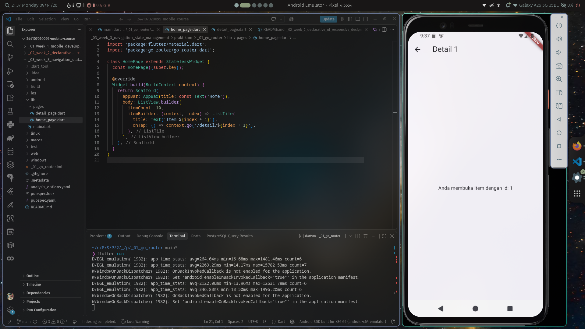
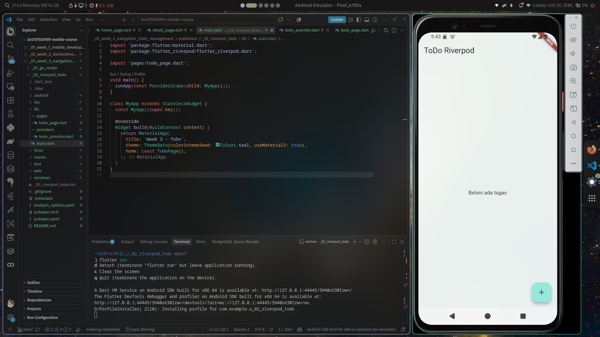
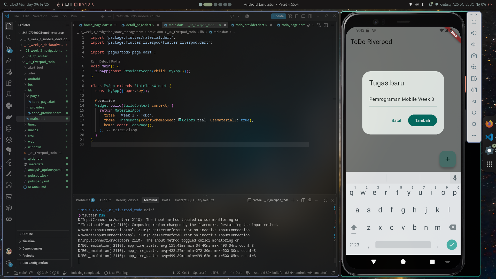
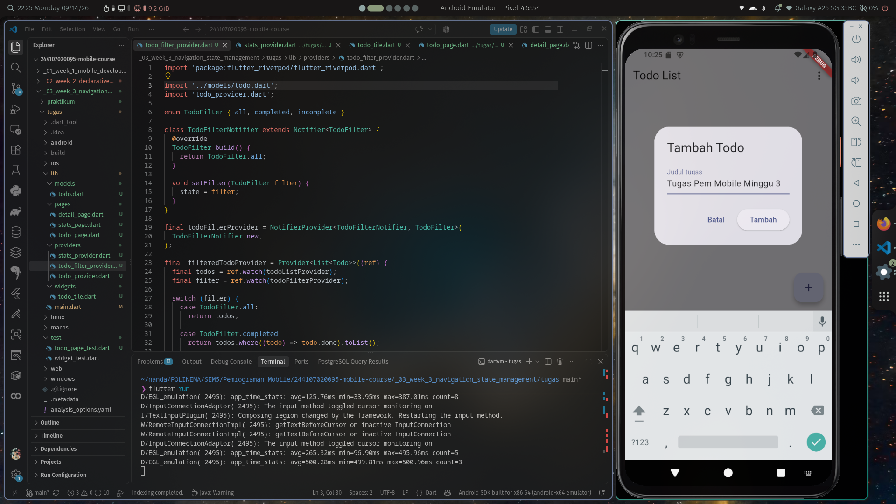
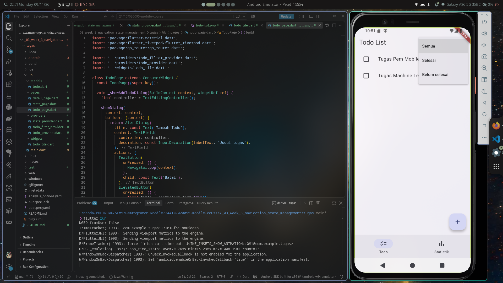
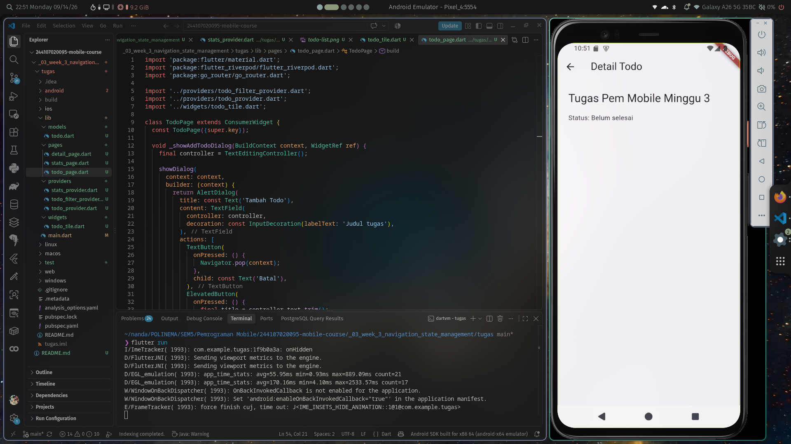
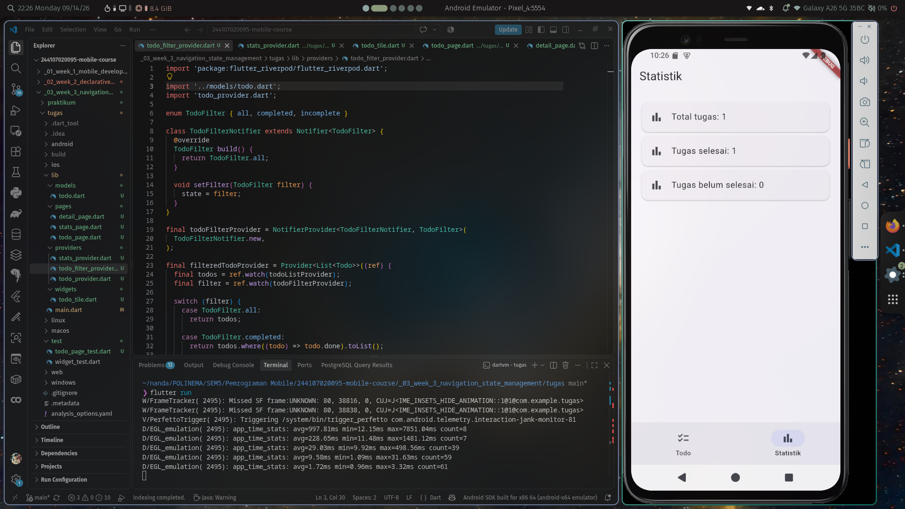

# Praktikum Week 3 — Navigation & State Management

## Identitas

| Nama               | Rachmad Febriananda           |
| Mata Kuliah        | Mobile Programming            |
| Minggu             | Week 3                        |
| Topik              | Navigation & State Management |
| Framework          | Flutter                       |
| Bahasa Pemrograman | Dart                          |

---

# 1. Pendahuluan

Pada praktikum minggu ke-3 dipelajari konsep **Navigation** dan **State Management** pada aplikasi Flutter.

Navigation digunakan untuk mengatur perpindahan antarhalaman dalam aplikasi. Pada praktikum ini digunakan **GoRouter** untuk membuat routing dan navigasi antarhalaman.

Selain navigation, dipelajari pula konsep **state management** menggunakan **Riverpod**. Riverpod digunakan untuk mengelola data aplikasi agar perubahan state dapat diamati dan digunakan oleh widget yang membutuhkan.

Praktikum juga membahas penggunaan **AsyncValue** untuk menangani proses asynchronous yang memiliki beberapa kondisi, yaitu loading, error, dan data/success.

Pada bagian akhir dilakukan AI Challenge, refactoring kode, pengujian aplikasi, serta pembuatan aplikasi Todo sederhana yang menggabungkan GoRouter dan Riverpod.

---

# 2. Tujuan Praktikum

Tujuan dari praktikum ini adalah:

1. Memahami konsep navigation pada Flutter.
2. Memahami penggunaan GoRouter untuk mengatur route aplikasi.
3. Memahami perbedaan navigation menggunakan Navigator dan GoRouter.
4. Membuat navigasi antarhalaman menggunakan GoRouter.
5. Memahami konsep state management.
6. Menggunakan Riverpod untuk mengelola state aplikasi.
7. Memahami penggunaan `Provider`, `ConsumerWidget`, dan `Notifier`.
8. Memahami penggunaan `AsyncValue`.
9. Menangani kondisi loading, error, dan success pada proses asynchronous.
10. Menggunakan AI sebagai alat bantu dalam pengembangan aplikasi.
11. Melakukan refactoring untuk membuat struktur kode lebih terorganisir.
12. Membuat widget test untuk memverifikasi fungsi aplikasi.

---

# 3. Praktikum 1 — GoRouter

## 3.1 Tujuan

Praktikum pertama bertujuan untuk memahami navigation menggunakan **GoRouter**.

GoRouter digunakan untuk mendefinisikan route aplikasi secara terstruktur serta memungkinkan navigasi menggunakan path tertentu.

## 3.2 Implementasi

Project dibuat menggunakan Flutter kemudian package GoRouter ditambahkan dengan perintah:

```bash
flutter create .
flutter pub add go_router
```

Struktur project:

```text
01-go-router/
├── lib/
│   ├── main.dart
│   └── pages/
│       ├── home_page.dart
│       └── detail_page.dart
└── pubspec.yaml
```

Pada aplikasi terdapat dua halaman:

* Home
* Detail

Route yang digunakan:

```text
/
└── /detail/:id
```

Pada halaman Home terdapat daftar item. Ketika salah satu item ditekan, aplikasi berpindah ke halaman Detail dengan membawa parameter `id`.

Contoh navigasi:

```dart
context.go('/detail/${index + 1}');
```

Parameter tersebut kemudian diterima oleh halaman Detail menggunakan:

```dart
state.pathParameters['id']
```

## 3.3 Hasil

Aplikasi berhasil menampilkan daftar item pada halaman Home dan dapat berpindah ke halaman Detail berdasarkan item yang dipilih.

### Screenshot Home



### Screenshot Detail



## 3.4 Kesimpulan Praktikum 1

GoRouter dapat digunakan untuk mengatur perpindahan halaman berdasarkan route. Parameter juga dapat dikirim melalui URL/path sehingga halaman tujuan dapat mengetahui data yang dipilih.

---

# 4. Praktikum 2 — Riverpod Todo

## 4.1 Tujuan

Praktikum kedua bertujuan untuk memahami penggunaan Riverpod sebagai state management.

Aplikasi yang dibuat berupa Todo sederhana yang memungkinkan pengguna:

* Menambahkan Todo.
* Mengubah status Todo.
* Menghapus Todo.

## 4.2 Implementasi

Package Riverpod ditambahkan menggunakan:

```bash
flutter pub add flutter_riverpod
```

State Todo dikelola menggunakan `Notifier`.

Struktur utama:

```text
02-riverpod-todo/
├── lib/
│   ├── main.dart
│   ├── pages/
│   │   └── todo_page.dart
│   └── providers/
│       └── todo_provider.dart
└── pubspec.yaml
```

Provider dibuat menggunakan:

```dart
final todoListProvider =
    NotifierProvider<TodoListNotifier, List<Todo>>(
  TodoListNotifier.new,
);
```

Pada widget digunakan:

```dart
ref.watch(todoListProvider);
```

untuk mengamati perubahan state.

Sedangkan untuk melakukan perubahan data digunakan:

```dart
ref.read(todoListProvider.notifier);
```

## 4.3 Pengelolaan State

Data Todo disimpan sebagai list.

Ketika Todo baru ditambahkan, state diperbarui menggunakan list baru:

```dart
state = [
  ...state,
  Todo(title),
];
```

Pendekatan tersebut menjaga agar data sebelumnya tidak dimodifikasi secara langsung.

## 4.4 Hasil

Aplikasi berhasil melakukan operasi dasar Todo.

### Screenshot Todo



### Screenshot Tambah Todo



### Screenshot Todo Selesai


## 4.5 Kesimpulan Praktikum 2

Riverpod dapat digunakan untuk memisahkan pengelolaan state dari tampilan aplikasi. Dengan `NotifierProvider`, perubahan data Todo dapat dikelola secara terstruktur dan widget dapat mengamati perubahan state menggunakan `ref.watch()`.

---

# 5. Praktikum 3 — AsyncValue

## 5.1 Tujuan

Praktikum ketiga membahas pengelolaan proses asynchronous menggunakan `AsyncValue`.

`AsyncValue` digunakan untuk merepresentasikan beberapa kemungkinan kondisi data asynchronous:

* Loading
* Error
* Data

## 5.2 Implementasi

Package Riverpod digunakan untuk membuat `AsyncNotifier`.

Struktur project:

```text
03-async-value/
├── lib/
│   ├── main.dart
│   ├── pages/
│   │   └── product_page.dart
│   └── providers/
│       └── products_provider.dart
└── pubspec.yaml
```

Proses asynchronous disimulasikan menggunakan:

```dart
await Future.delayed(
  const Duration(seconds: 2),
);
```

Provider menggunakan:

```dart
AsyncNotifierProvider
```

State kemudian ditampilkan menggunakan:

```dart
products.when(
  loading: () => ...,
  error: (error, stackTrace) => ...,
  data: (data) => ...,
);
```

## 5.3 Loading State

Ketika data sedang dimuat, aplikasi menampilkan:

```text
CircularProgressIndicator
```

## 5.4 Success State

Ketika proses berhasil, aplikasi menampilkan daftar produk.

### Screenshot Success


## 5.5 Error State

Untuk menguji kondisi error, proses pengambilan data dibuat menghasilkan exception.

Aplikasi kemudian menampilkan pesan kesalahan dan tombol untuk melakukan percobaan kembali.

## 5.6 Kesimpulan Praktikum 3

`AsyncValue` memudahkan pengelolaan state asynchronous karena kondisi loading, error, dan data dapat ditangani secara terstruktur.

---

# 6. Praktikum 4 — AI Challenge

## 6.1 Tujuan

AI Challenge bertujuan untuk menggunakan AI sebagai alat bantu dalam pengembangan fitur Flutter.

AI digunakan untuk membuat halaman statistik menggunakan Riverpod dan `AsyncNotifier`.

Requirement yang diberikan kepada AI meliputi:

* Menggunakan `ConsumerWidget`.
* Menggunakan `AsyncNotifier`.
* Menggunakan `AsyncNotifierProvider`.
* Menggunakan delay 2 detik.
* Memiliki kemungkinan error 30%.
* Menampilkan loading, error, dan success.
* Memiliki retry.
* Membuat unit test.
* Melakukan verifikasi menggunakan Flutter analyzer dan test.

## 6.2 AI Assistant

AI assistant yang digunakan adalah **ChatGPT**.

Prompt yang digunakan disimpan pada:

```text
praktikum/04-ai-challenge/docs/ai_prompt.md
```

Output AI didokumentasikan pada:

```text
praktikum/04-ai-challenge/docs/ai_output.md
```

## 6.3 Implementasi

Provider menggunakan:

```dart
class StatsNotifier extends AsyncNotifier<List<String>>
```

Kemungkinan error dibuat menggunakan:

```dart
if (Random().nextDouble() < 0.3) {
  throw Exception(
    'Gagal mengambil data statistik',
  );
}
```

Dengan demikian, terdapat kemungkinan sekitar 30% proses pengambilan data menghasilkan error.

## 6.4 Penanganan State

Halaman statistik menangani tiga kondisi menggunakan:

```dart
stats.when(
  loading: () => ...,
  error: (error, stackTrace) => ...,
  data: (data) => ...,
);
```

## 6.5 Retry

Ketika terjadi error, pengguna dapat mencoba kembali menggunakan:

```dart
ref.invalidate(statsProvider);
```

## 6.6 Testing

Provider juga diuji menggunakan Flutter test.

Perintah yang digunakan:

```bash
flutter analyze
```

dan:

```bash
flutter test
```

Hasil pengujian dicatat pada:

```text
praktikum/04-ai-challenge/docs/verification.md
```

### Screenshot AI Challenge Success


---

# 7. Refactoring

## 7.1 Tujuan Refactoring

Refactoring dilakukan untuk memperbaiki struktur kode agar lebih terorganisir dan mudah dipelihara.

Refactoring tidak mengubah tujuan utama aplikasi, tetapi memisahkan tanggung jawab kode ke dalam file dan komponen yang lebih sesuai.

## 7.2 Extract TodoTile

Sebelumnya kode tampilan Todo ditulis langsung di dalam `TodoPage`.

Kode tersebut kemudian dipisahkan menjadi widget:

```text
lib/widgets/todo_tile.dart
```

Widget `TodoTile` bertanggung jawab untuk menampilkan satu item Todo.

Dengan demikian, `TodoPage` tidak perlu menangani seluruh detail tampilan Todo secara langsung.

## 7.3 Filter Todo

Ditambahkan provider untuk mengatur filter:

```dart
enum TodoFilter {
  all,
  completed,
  incomplete,
}
```

Filter yang tersedia:

* Semua
* Selesai
* Belum selesai

Provider filter dibuat menggunakan `NotifierProvider`.

Data yang ditampilkan kemudian berasal dari:

```dart
filteredTodoProvider
```

## 7.4 Integrasi Navigation

GoRouter digunakan untuk menghubungkan halaman:

```text
/                  → Todo
/detail/:id        → Detail Todo
/stats             → Statistik
```

Navigasi dari Todo menuju Detail menggunakan:

```dart
context.push('/detail/$originalIndex');
```

Sedangkan perpindahan antara Todo dan Statistik menggunakan:

```dart
context.go('/stats');
```

dan:

```dart
context.go('/');
```

## 7.5 NavigationBar

Aplikasi menggunakan `NavigationBar` dengan dua menu utama:

```text
[ Todo ]     [ Statistik ]
```

NavigationBar digunakan pada halaman Todo dan Statistik sehingga pengguna dapat berpindah antarhalaman dengan mudah.

---

# 8. Tugas Akhir — Todo & Statistics App

## 8.1 Deskripsi

Pada tugas akhir dibuat aplikasi Todo sederhana yang menggabungkan konsep yang telah dipelajari selama Week 3.

Aplikasi terdiri dari:

1. Halaman Todo.
2. Halaman Detail Todo.
3. Halaman Statistik.

Teknologi yang digunakan:

* Flutter
* Dart
* GoRouter
* Riverpod
* AsyncNotifier
* AsyncValue
* Flutter Test

---

# 9. Struktur Project

```text
tugas/
├── lib/
│   ├── main.dart
│   ├── models/
│   │   └── todo.dart
│   ├── providers/
│   │   ├── todo_provider.dart
│   │   ├── todo_filter_provider.dart
│   │   └── stats_provider.dart
│   ├── pages/
│   │   ├── todo_page.dart
│   │   ├── detail_page.dart
│   │   └── stats_page.dart
│   └── widgets/
│       └── todo_tile.dart
├── test/
│   └── todo_page_test.dart
├── screenshots/
├── README.md
└── pubspec.yaml
```

---

# 10. Fitur Aplikasi

## 10.1 Menambahkan Todo

Pengguna dapat menambahkan Todo baru melalui tombol `+`.

### Screenshot



---

## 10.2 Menampilkan Todo

Todo yang telah ditambahkan ditampilkan pada halaman utama.

### Screenshot


---

## 10.3 Mengubah Status Todo

Pengguna dapat mencentang Todo untuk mengubah status menjadi selesai.

### Screenshot


---

## 10.4 Menghapus Todo

Setiap Todo memiliki tombol delete untuk menghapus data.

---

## 10.5 Filter Todo

Aplikasi menyediakan tiga filter:

```text
Semua
Selesai
Belum selesai
```

### Screenshot Filter



---

# 11. Detail Todo

Ketika Todo ditekan, aplikasi berpindah ke halaman Detail.

Route yang digunakan:

```text
/detail/:id
```

Halaman Detail menampilkan:

* Judul Todo.
* Status Todo.

### Screenshot Detail



---

# 12. Halaman Statistik

Halaman Statistik menggunakan `AsyncNotifier` untuk mengambil data statistik.

Data yang ditampilkan meliputi:

* Total tugas.
* Tugas selesai.
* Tugas belum selesai.

Proses pengambilan data disimulasikan dengan delay 2 detik.

### Screenshot Statistik



---

# 13. State Management

State management aplikasi menggunakan Riverpod.

Provider utama:

```text
todoListProvider
todoFilterProvider
filteredTodoProvider
statsProvider
```

`todoListProvider` digunakan untuk menyimpan data Todo.

`todoFilterProvider` digunakan untuk menyimpan filter yang sedang dipilih.

`filteredTodoProvider` digunakan untuk menghasilkan daftar Todo berdasarkan filter.

`statsProvider` digunakan untuk mengelola data statistik secara asynchronous.

---

# 14. Navigation

GoRouter digunakan untuk mengatur route aplikasi.

Konfigurasi route:

| Route         | Halaman         |
| ------------- | --------------- |
| `/`           | Todo Page       |
| `/detail/:id` | Detail Page     |
| `/stats`      | Statistics Page |

NavigationBar digunakan untuk berpindah antara:

```text
Todo ↔ Statistik
```

Sedangkan Todo dapat ditekan untuk membuka halaman Detail.

---

# 15. AsyncValue

Halaman Statistik menggunakan `AsyncValue` untuk menangani tiga kondisi.

### Loading

```dart
loading: () => ...
```

Menampilkan indikator proses ketika data sedang dimuat.

### Error

```dart
error: (error, stackTrace) => ...
```

Menampilkan pesan error dan tombol retry.

### Success

```dart
data: (data) => ...
```

Menampilkan data statistik ketika proses berhasil.

---

# 16. Testing

Pengujian dilakukan menggunakan Flutter Widget Test.

Test yang dibuat memverifikasi bahwa pengguna dapat menambahkan Todo.

Skenario pengujian:

1. Membuka halaman Todo.
2. Menekan tombol tambah.
3. Mengisi teks:

```text
Kerjakan PR minggu 3
```

4. Menekan tombol Tambah.
5. Memastikan teks Todo muncul pada halaman.

Perintah yang digunakan:

```bash
flutter test
```

---

# 17. Static Analysis

Sebelum aplikasi dijalankan, dilakukan pemeriksaan kode menggunakan:

```bash
flutter analyze
```

Tujuannya adalah memastikan tidak terdapat error atau masalah analisis pada kode.


---

# 18. Pengujian Aplikasi

Aplikasi diuji secara langsung menggunakan:

```bash
flutter run
```

Pengujian dilakukan terhadap:

* Penambahan Todo.
* Checklist Todo.
* Penghapusan Todo.
* Filter Todo.
* Navigasi ke Detail.
* Navigasi ke Statistik.
* Loading Statistik.
* Tampilan data Statistik.
* Retry ketika terjadi error.

---

# 19. Hasil Akhir

Setelah seluruh implementasi selesai, aplikasi berhasil menggabungkan beberapa konsep yang telah dipelajari pada Week 3.

Implementasi akhir memiliki:

* Navigation menggunakan GoRouter.
* Parameter route pada halaman Detail.
* State management menggunakan Riverpod.
* `NotifierProvider` untuk Todo.
* Filter Todo menggunakan provider.
* `ConsumerWidget` untuk membaca state.
* `AsyncNotifierProvider` untuk data Statistik.
* `AsyncValue` untuk loading, error, dan success.
* NavigationBar untuk navigasi utama.
* Widget Test untuk pengujian penambahan Todo.
* Struktur kode yang telah dilakukan refactoring.

---

# 20. Kesimpulan

Pada praktikum Week 3 telah dipelajari konsep Navigation dan State Management pada Flutter.

GoRouter digunakan untuk membuat navigasi antarhalaman yang lebih terstruktur dengan menggunakan route seperti `/`, `/detail/:id`, dan `/stats`.

Riverpod digunakan sebagai state management untuk mengelola data Todo dan filter. Penggunaan `Notifier` memungkinkan perubahan state dilakukan secara terstruktur, sedangkan `ConsumerWidget` digunakan untuk mengamati state pada UI.

Konsep `AsyncValue` juga dipelajari untuk menangani proses asynchronous dengan tiga kondisi utama, yaitu loading, error, dan success.

Selain itu, AI digunakan sebagai alat bantu dalam AI Challenge. Hasil yang diberikan AI tetap diperiksa menggunakan static analysis dan testing sehingga kode tidak langsung digunakan tanpa verifikasi.

Pada tahap refactoring, kode Todo dipisahkan menjadi beberapa komponen seperti provider, model, dan `TodoTile` sehingga struktur project menjadi lebih terorganisir.

Melalui tugas akhir, seluruh konsep tersebut kemudian digabungkan menjadi sebuah aplikasi Todo sederhana yang memiliki navigasi, state management, filter, halaman detail, statistik asynchronous, serta widget testing.
