# Laporan Praktikum Minggu 5 — Local Storage & Offline-First

**Mata kuliah:** Pemrograman Mobile
**Topik:** SharedPreferences, SQLite, repository, Riverpod, offline-first,
testing, dan sinkronisasi
**Project:** Offline Notes
**Codelab:** [05 Minggu 5 — Local Storage Offline-First](https://jti-polinema.github.io/flutter-codelab/05-minggu-5-local-storage-offline-first/index.html#0)

## 1. Tujuan

Praktikum ini bertujuan memahami pemilihan storage lokal dan membangun
aplikasi Flutter yang tetap dapat dibaca dan ditulis tanpa internet. Codelab
menargetkan kemampuan untuk:

- membedakan key-value, relasional, dan NoSQL embedded;
- menyimpan preferensi dengan SharedPreferences;
- menerapkan CRUD catatan dengan SQLite melalui repository;
- menerapkan cache-first read, dirty flag, dan antrean sinkronisasi;
- menampilkan loading, error, empty, dan success dengan Riverpod;
- menguji model dan provider menggunakan repository palsu tanpa database asli.

## 2. Deskripsi aplikasi

Offline Notes adalah aplikasi catatan yang menyimpan data secara lokal.
Preferensi tema dan waktu terakhir dibuka disimpan dengan
`SharedPreferences`, sedangkan catatan disimpan di SQLite melalui `sqflite`.
Daftar catatan diurutkan berdasarkan `updated_at` terbaru.

Fitur yang dibuat:

- tambah dan hapus catatan;
- detail catatan melalui `/note/:id`;
- toggle tema gelap/terang;
- pencatatan waktu terakhir aplikasi dibuka;
- badge `Belum tersinkron` untuk catatan `dirty`;
- switch simulasi mode offline;
- sinkronisasi simulasi dan penghitung catatan dirty;
- cache-first untuk data bacaan;
- state loading, error, empty, dan success;
- unit test model, provider palsu, dan widget `NoteTile`.

## 3. Praktikum 1 — Preferensi dengan SharedPreferences

### Implementasi

Seluruh akses key-value dipusatkan di
[`lib/data/prefs.dart`](lib/data/prefs.dart) melalui `PrefsRepository`.
Key yang digunakan:

| Key | Nilai | Fungsi |
|---|---|---|
| `dark_mode` | `bool` | menyimpan tema gelap/terang |
| `last_opened_at` | ISO-8601 `String` | menyimpan waktu terakhir dibuka |

Provider `darkModeProvider` mengelola pembacaan dan perubahan preferensi.
`main()` memanggil `markOpenedNow()` sebelum aplikasi ditampilkan, sedangkan
[`settings_page.dart`](lib/pages/settings_page.dart) menampilkan toggle dan
waktu terakhir dibuka.

### Hasil

Tema dapat diubah, disimpan, dan tetap terbaca ketika aplikasi dijalankan
kembali. Waktu terakhir dibuka tampil dalam format ISO-8601.

## 4. Praktikum 2 — Model, database, dan repository SQLite

### Model

[`lib/data/local/note.dart`](lib/data/local/note.dart) memiliki field:

| Field | Tipe | Keterangan |
|---|---|---|
| `id` | `int?` | primary key SQLite |
| `title` | `String` | judul catatan |
| `body` | `String` | isi catatan |
| `updatedAt` | `DateTime` | waktu perubahan terakhir |
| `dirty` | `bool` | belum atau sudah disinkronkan |

`toMap()` mengubah `dirty` menjadi `0/1`, sedangkan `fromMap()` menggunakan
nilai default yang aman jika field tidak tersedia.

### Skema database

[`lib/data/local/db.dart`](lib/data/local/db.dart) membuat tabel `notes` dan
`cached_posts`:

```sql
CREATE TABLE notes(
  id INTEGER PRIMARY KEY AUTOINCREMENT,
  title TEXT NOT NULL,
  body TEXT NOT NULL DEFAULT '',
  updated_at TEXT NOT NULL,
  dirty INTEGER NOT NULL DEFAULT 0
);
```

Untuk kebutuhan produksi, migrasi dilakukan dengan menaikkan `version` dan
menambahkan `onUpgrade`, bukan menjalankan `onCreate` ulang.

### Repository

[`lib/data/repositories/note_repository.dart`](lib/data/repositories/note_repository.dart)
menjadi satu-satunya pintu ke SQLite. Method yang digunakan:

- `fetchNotes()` dengan `ORDER BY updated_at DESC`;
- `fetchNote(id)` untuk halaman detail;
- `addNote()` dengan `dirty = true`;
- `deleteNote(id)`;
- `countDirty()`;
- `markAllSynced()`.

UI tidak memanggil SQLite secara langsung. UI hanya berkomunikasi melalui
provider Riverpod dan repository.

## 5. Praktikum 3 — Offline-first dan sinkronisasi

### Cache-first read

Data lokal dibaca terlebih dahulu sehingga halaman tidak blank ketika offline.
Cache posts dan fungsi sinkronisasi dipusatkan di
[`lib/data/sync.dart`](lib/data/sync.dart). Data remote pada codelab
disimulasikan; mekanisme yang diuji adalah membaca cache, menyimpan hasil,
dan melakukan invalidasi provider.

### Dirty flag

Catatan baru diberi `dirty = 1`. `syncNotes()` menghitung catatan dirty,
menunggu simulasi respons server, lalu memanggil `markAllSynced()` hanya jika
proses dianggap berhasil. Saat mode offline aktif, sinkronisasi ditolak dengan
pesan yang jelas dan dirty tetap dipertahankan.

### Aturan konflik

Aplikasi menggunakan **last-write-wins** berdasarkan `updated_at`. Versi
dengan waktu perubahan paling baru dipertahankan. Jika kebutuhan berkembang
menjadi retry per operasi, urutan operasi, dan pelacakan error, dirty flag akan
diganti atau dilengkapi tabel `outbox`.

## 6. AI Challenge

### Prompt

> Aplikasi Flutter Offline Notes: CRUD catatan + preferensi tema. Bandingkan
> SharedPreferences, Hive, sqflite (SQLite), dan Drift untuk dua kebutuhan ini.
> Kriteria: kompleksitas query, kebutuhan relasi, reaktivitas (stream),
> type-safety, ukuran boilerplate, dan kemudahan testing. Beri rekomendasi
> final: mana untuk preferensi, mana untuk catatan, beserta alasannya dalam
> 1 tabel. Tunjukkan skema tabel/kotak untuk 1000+ catatan. Jelaskan trade-off
> setiap pilihan.

Output, verifikasi, dan skema lengkap tersedia di
[`docs/ai-challenge.md`](docs/ai-challenge.md).

### Perbandingan final

| Storage | Query/relasi | Reaktivitas | Type-safety | Boilerplate | Keputusan |
|---|---|---|---|---|---|
| SharedPreferences | key-value sederhana, tanpa relasi | tidak ada stream bawaan | rendah | sangat kecil | preferensi saja |
| Hive | box dan query sederhana | terbatas | sedang dengan adapter | kecil-sedang | alternatif cache/object |
| sqflite/SQLite | SQL, indeks, transaksi, relasi | perlu invalidasi/stream manual | sedang | sedang | catatan aplikasi ini |
| Drift | SQL terstruktur dan relasi | `watch()` bawaan | tinggi, code generation | besar | alternatif aplikasi lebih kompleks |

### Verifikasi keputusan

- Daftar catatan **tidak** ditempatkan di SharedPreferences karena koleksi
  JSON besar sulit dicari, diurutkan, dimigrasikan, dan diperbarui sebagian.
- Skema catatan memakai `dirty` dan `updated_at`, bukan CRUD polos saja.
- Klaim real-time hanya diterima jika didukung stream seperti Drift `watch()`.
  `sqflite` pada project ini memakai invalidasi provider.
- Setelah instalasi, SharedPreferences memiliki boilerplate paling kecil,
  sqflite sedang, dan Drift paling besar karena code generation.
- Keputusan akhir: SharedPreferences untuk preferensi, SQLite untuk catatan.

## 7. Refactoring, testing, dan error umum

### Refactoring

1. Baris catatan diekstrak menjadi [`NoteTile`](lib/widgets/note_tile.dart)
   dengan badge dirty.
2. Cache posts dan `syncNotes` dipindahkan ke
   [`lib/data/sync.dart`](lib/data/sync.dart).
3. Halaman detail [`NoteDetailPage`](lib/pages/note_detail_page.dart)
   membaca ulang catatan dari repository lokal melalui provider family, bukan
   memakai object dari state halaman list.
4. Routing didefinisikan dengan GoRouter: `/`, `/note/:id`, dan `/settings`.

### Testing

[`test/note_test.dart`](test/note_test.dart) menguji:

- `Note.fromMap()` aman ketika field map hilang;
- flag dirty bertahan setelah serialisasi dan deserialisasi;
- provider berhasil mengambil data dari `FakeNoteRepository` tanpa SQLite.

[`test/widget_test.dart`](test/widget_test.dart) menguji badge
`Belum tersinkron` pada `NoteTile`.

Hasil terakhir:

```text
flutter test
00:00 +4: All tests passed!
```

`flutter build apk --debug` juga berhasil. `flutter analyze` hanya melaporkan
info penamaan package `_05_week_5_local_storage_offline_first`, bukan error
kompilasi.

### Error yang ditemukan dan penyelesaiannya

Pada proses awal, `note_detail_page.dart` gagal dikompilasi karena
`noteRepositoryProvider` belum di-import. Import provider ditambahkan.
Test awal juga gagal karena `ListTile` belum memiliki ancestor `Material`;
test diperbaiki dengan membungkus `NoteTile` dalam `Scaffold`.

Error `MissingPluginException` dihindari dengan melakukan full run setelah
menambah plugin, bukan hanya hot reload. Perubahan skema database harus
menaikkan versi dan mengimplementasikan `onUpgrade`.

## 8. Tugas akhir / Industry Challenge

### Checklist implementasi

| Requirement | Implementasi | Status |
|---|---|---|
| Tema dan terakhir dibuka | SharedPreferences + settings page | Selesai |
| CRUD persisten | sqflite + `NoteRepository` | Selesai |
| Urutan terbaru | `updated_at DESC` | Selesai |
| Cache-first | local cache dan repository | Selesai |
| Dirty flag + sync | `syncNotes`, `countDirty`, `markAllSynced` | Selesai |
| Konflik eksplisit | last-write-wins berdasarkan `updated_at` | Selesai |
| Mode pesawat | switch `Offline` dan catatan lokal | Selesai |
| Minimal dua test | model, provider palsu, dan widget | Selesai |
| Dokumentasi AI | prompt, tabel, skema, verifikasi | Selesai |
| Struktur portfolio | `lib/`, `test/`, `docs/`, `README.md`, `screenshots/` | Selesai |

### Cara menjalankan

```bash
flutter pub get
flutter analyze
flutter test
flutter run
```

Untuk demo:

1. buka aplikasi dan tambahkan catatan;
2. aktifkan switch `Offline`;
3. tambahkan atau baca catatan tanpa koneksi;
4. amati badge `Belum tersinkron`;
5. matikan switch offline;
6. tekan tombol sinkronisasi dan amati badge hilang.

## 9. Galeri screenshot berdasarkan waktu

Screenshot berikut adalah bukti proses dari praktikum hingga tugas akhir.
Nama file menyimpan waktu pengambilan, sehingga urutannya dipertahankan dari
yang paling awal sampai paling akhir.

| Waktu | Tahap/keterangan | Bukti |
|---|---|---|
| 13:30:33 | Kode repository preferensi SharedPreferences | 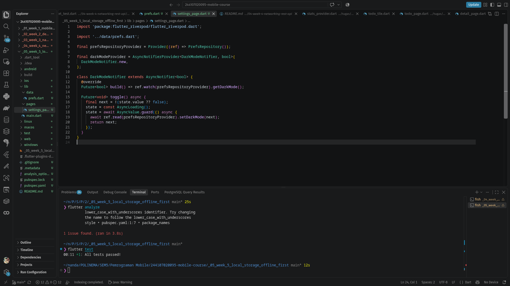 |
| 13:41:18 | Halaman Pengaturan, toggle tema terang | 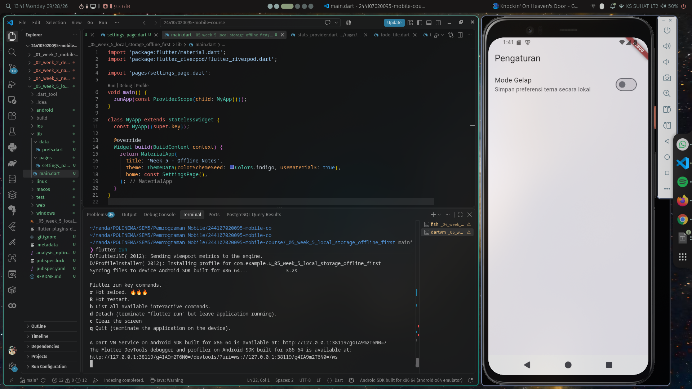 |
| 13:42:06 | Toggle tema gelap berhasil berubah | 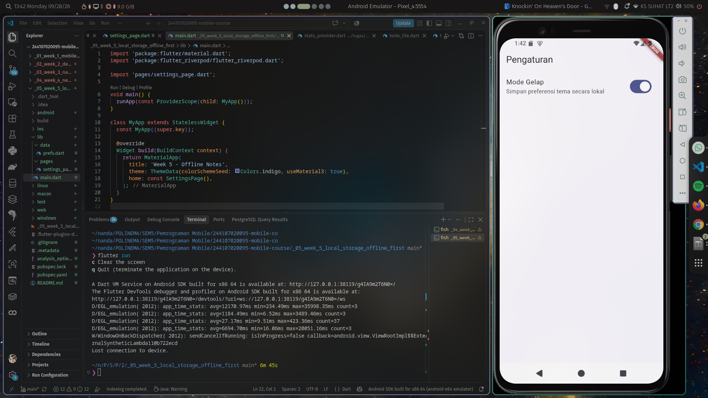 |
| 13:52:45 | Waktu terakhir dibuka tampil | 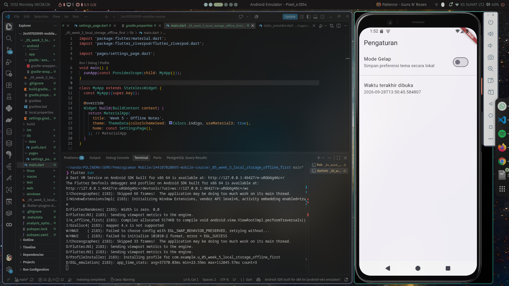 |
| 13:53:34 | Preferensi tersimpan setelah dibuka kembali | 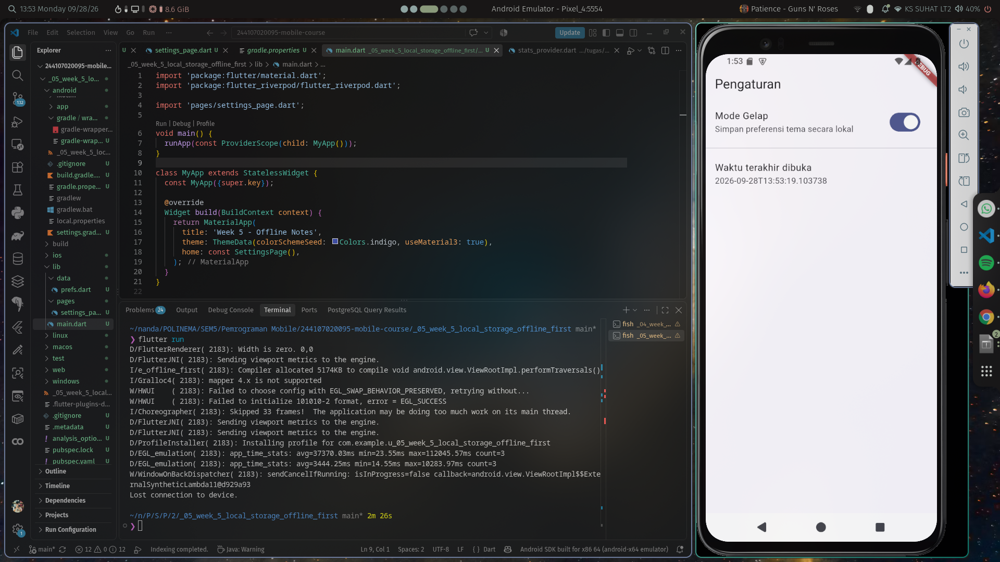 |
| 14:17:41 | Praktikum SQLite: daftar masih kosong | 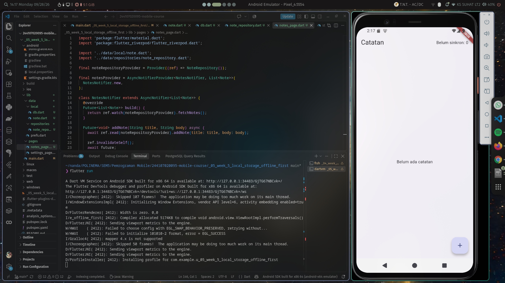 |
| 14:18:20 | Catatan SQLite berhasil ditambahkan | 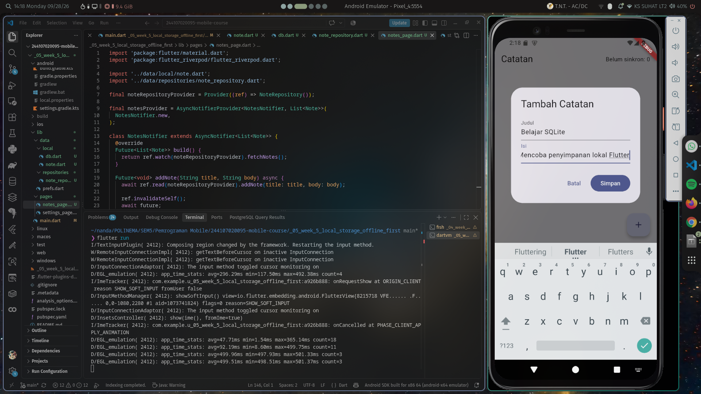 |
| 14:18:44 | Dialog tambah catatan dan input form | 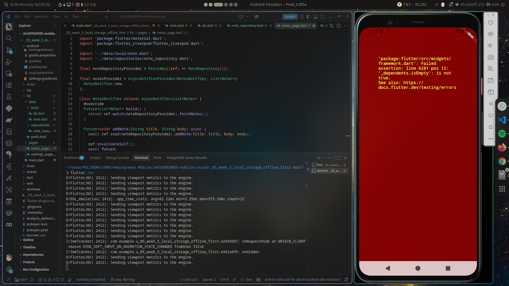 |
| 14:19:48 | Error runtime saat proses awal, menjadi bahan debugging | 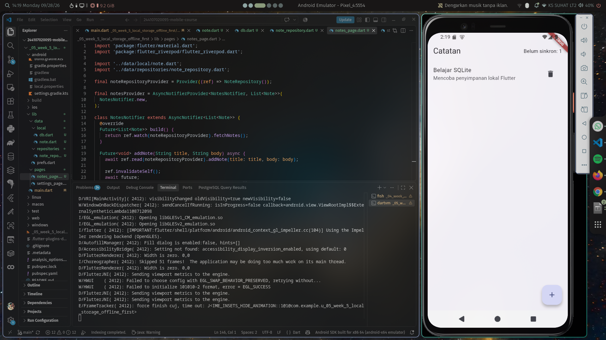 |
| 14:23:10 | Dua catatan tersimpan secara persisten | 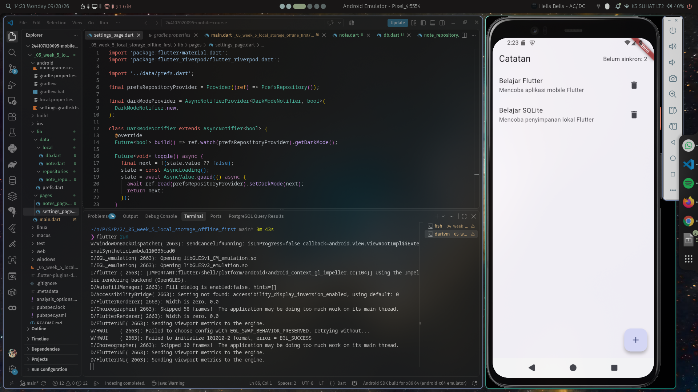 |
| 15:31:19 | Mode Offline aktif, badge dirty terlihat | 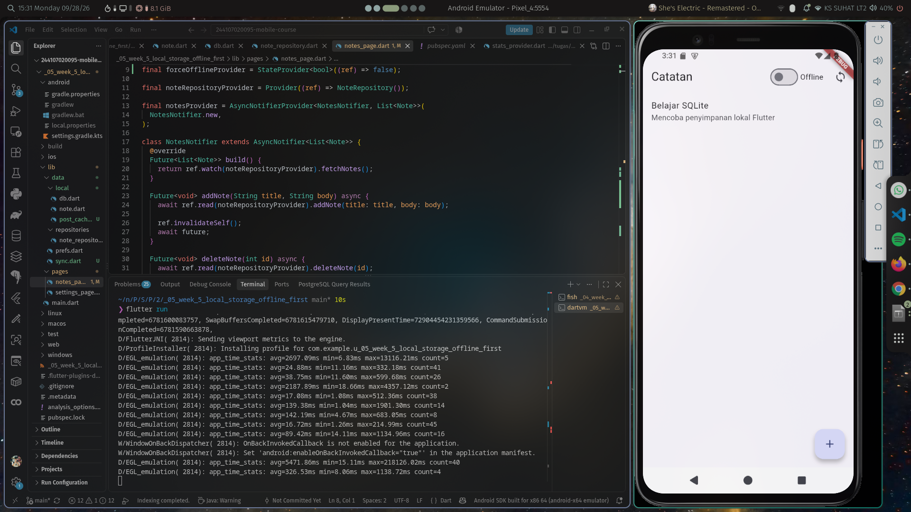 |
| 15:32:02 | Daftar tetap dapat dibaca saat offline |  |
| 15:32:23 | Catatan lokal tetap tampil dalam mode offline | 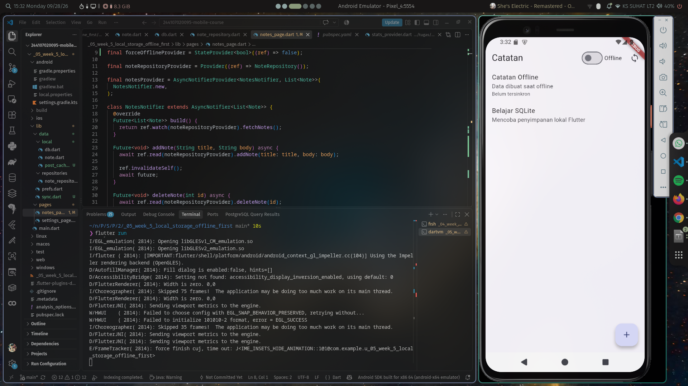 |
| 15:32:33 | Setelah sync, catatan tetap tersedia dan badge berubah | 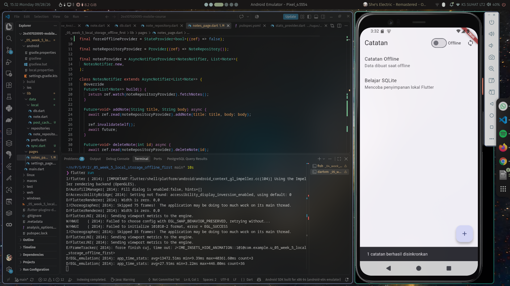 |
| 16:28:46 | Hasil akhir: mode gelap, settings, detail, dan catatan offline | 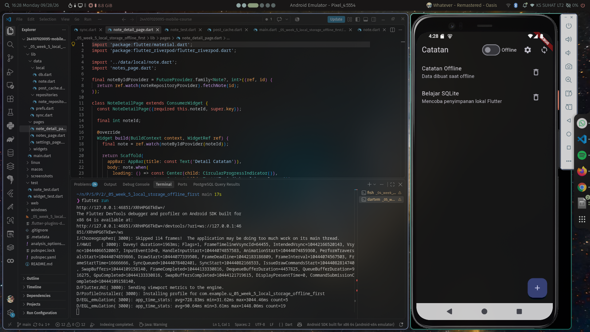 |

## 10. Refleksi

### Mengapa daftar catatan tidak boleh disimpan di SharedPreferences?

SharedPreferences dirancang untuk nilai kecil seperti boolean, string, atau
angka. Jika seluruh daftar disimpan sebagai satu JSON besar, update satu
catatan harus membaca dan menulis ulang seluruh koleksi. Query pencarian,
pengurutan, transaksi, indeks, migrasi, dan pemulihan data menjadi rapuh.
Karena itu daftar catatan menggunakan SQLite.

### Kapan cache-first cukup?

Cache-first cocok untuk data yang harus segera tersedia dan masih berguna
ketika offline, seperti catatan. Untuk harga real-time, saldo, atau stok,
data lama dapat menyebabkan keputusan yang salah; kebutuhan tersebut lebih
tepat menggunakan network-first atau stale-while-revalidate dengan penanda
waktu dan status kesegaran.

### Bagaimana dirty flag menjadi antrean sync?

`dirty = 1` adalah antrean minimal: query memilih semua catatan yang belum
terkirim, lalu masing-masing ditandai bersih setelah server mengembalikan
respons sukses. Karena proses memakai `Future` dan tidak memblokir frame UI,
pengguna tetap dapat membaca dan menulis. Tabel outbox diperlukan jika create,
update, dan delete harus dilacak sebagai operasi terpisah, diurutkan, di-retry,
dan dicatat error-nya.

### Bagian AI yang ditolak

Rekomendasi utama AI tidak ditolak: SharedPreferences memang sesuai untuk
preferensi dan SQLite sesuai untuk catatan. Yang ditolak adalah anggapan bahwa
sqflite otomatis real-time; sqflite tidak menyediakan `watch()` bawaan.
Project ini menggunakan invalidasi provider, sedangkan Drift lebih tepat jika
stream reaktif dan type-safety menjadi prioritas utama.

## 11. Kesimpulan

Kombinasi SharedPreferences + SQLite memenuhi kebutuhan aplikasi Offline Notes:
storage sederhana untuk preferensi, database relasional untuk catatan, serta
dirty flag untuk sinkronisasi tertunda. Riverpod menjaga UI tidak bergantung
langsung pada platform storage, repository memusatkan akses data, dan test
repository palsu memastikan provider dapat diuji tanpa database sungguhan.

## Referensi

- [Codelab resmi Minggu 5](https://jti-polinema.github.io/flutter-codelab/05-minggu-5-local-storage-offline-first/index.html#0)
- [Dokumentasi AI Challenge](docs/ai-challenge.md)
- [Dokumentasi offline-first](docs/offline-first.md)
